# **Arch Eclipse**

# Description

This is my daily driver configuration that I use on both my laptop and desktop for coding, gaming, trading, browsing the web, etc., with Dvorak in mind. I am constantly adding new features and improvements.

I use Arch BTW.. :)

> **Feel free to open an issue ♡ (anything you can think of)!**

# Discord

Official [Discord](https://discord.gg/fMGt4vH6s5) server.

# Design Philosophy

- Enhanced productivity
- Faster responsiveness
- Smooth animations
- Vibrant color schemes
- It just works

# Features

- **Dynamic wallpapers** based on each workspace: Custom scripts & [Hyprpaper](https://github.com/hyprwm/hyprpaper)
- **Dynamic color schemes** based on current wallpaper: Custom scripts & [PyWal](https://github.com/dylanaraps/pywal)
- **Global Theme switcher (Light/Dark)**: Custom scripts
- **Ags V3 - GTK 4 widgets** ~~(Eww replaced & Ags V2 - Gtk 3 replaced)~~: _these are just some of the features_
  - Dynamic Color schemes based on current wallpaper
  - Dark/light modes
  - Main bar
    - Bandwidth speed monitor
    - Weather
    - Media Player
    - Tray System
    - Notification Popups
    - Crypto display
  - Application launcher ~~(Rofi replaced)~~
    - App launcher
    - Emojis
    - Arithmetics
    - Url forwarding to default browser
    - Custom commands
  - Wallpaper switcher for each workspace
  - Media player
  - Right Panel
    - Waifu display -- using [Danbooru](https://danbooru.donmai.us) & [Gelbooru](https://gelbooru.com) APIs & Custom Images/Gifs
    - Media Player
    - Notification history - filter
    - Calendar
    - Script Timer
    - Crypto Viewer
  - Left Panel
    - Chat Bot -- multiple APIs + image generation
    - Booru Viewer -- using [Danbooru](https://danbooru.donmai.us) & [Gelbooru](https://gelbooru.com) APIs
    - Manga Reader -- Using [MangaDex](https://mangadex.org/) API
    - Hyprland/Ags settings
    - Custom Scripts
  - User Panel (logout etc...)
- **High-quality wallpapers** from [Danbooru](https://danbooru.donmai.us), [Yandere](https://yande.re), & [Gelbooru](https://gelbooru.com)

# Current Workflow

> **Important:** Screenshots below ⊽

| W1  | W2      | W3  | W4                                                  | W5                                           | W6                                                  | W7                                                                            | W8  | W9  | W10   |
| --- | ------- | --- | --------------------------------------------------- | -------------------------------------------- | --------------------------------------------------- | ----------------------------------------------------------------------------- | --- | --- | ----- |
| --- | Browser | --- | [Spotify](https://wiki.archlinux.org/title/spotify) | [Btop](https://github.com/aristocratos/btop) | [Discord](https://wiki.archlinux.org/title/Discord) | [Steam](https://wiki.archlinux.org/title/steam)/[Lutris](https://lutris.net/) | --- | --- | Games |

- **W`id`**: Workspace with corresponding ID.
- **`---`**: Placeholder, any app can go here.
- **`name`**: Application that opens automatically in its designated workspace.

# To-Do List

- **Users: Any suggestions or issues?**
- Make sure the dot-files work for every machine not just mine **(WIP)**
- Add tutorials for each part of the dot-files **(WIP)**
- Continuous improvements and polishing **(INDEFINITELY)**

# KeyBinds

KeyBinds are displayed and organized [Here](https://github.com/AymanLyesri/hyprland-conf/blob/master/.config/hypr/configs/keybinds.conf), be sure to check them out!

# Installation and Update

## Required Dependencies and packages

- [Arch Linux](https://archlinux.org/) (I use Arch linux BTW)
- [Hyprland](https://hyprland.org/)
- [Necessary packages](https://github.com/AymanLyesri/hyprland-conf/blob/master/.config/hypr/pacman/pkglist.txt) (do not worry they will be installed automatically)

## Installation Guide

> Run this one liner in the terminal -- Say `Yes` to everything

```bash
bash -c "$(curl -fsSL https://raw.githubusercontent.com/AymanLyesri/ArchEclipse/refs/heads/master/.config/hypr/maintenance/INSTALL.sh)"
```

## Update Guide

> To update the config and its related pkgs Simply run `update` in the terminal

```bash
update
```

# Tips

- User Icon is stored in `$HOME/.face.icon`
- Press `SUPER + w` to select the wallpaper you like
- Custom wallpapers should be added in `$HOME/.config/wallpapers/custom`
- Custom hyprland configuration should be put in `$HOME/.config/hypr/configs/custom`
- Most functionalities have associated [keybinds](https://github.com/AymanLyesri/hyprland-conf/blob/master/.config/hypr/configs/keybinds.conf). Check them out!

> **Important**: If you encounter any problems, no matter how small, please feel free to open an issue. I’m happy to help! :)

# Additional Notes

- Machines with batteries (aka: laptops) require `upower` to be installed for battery monitoring to work properly.

# Star History

[](https://star-history.com/#aymanlyesri/hyprland-conf&Date)

# Visuals

## Application Launcher

| Apps                                           | Emojis                                           | Arithmetics                                           | URLs                                           |
| ---------------------------------------------- | ------------------------------------------------ | ----------------------------------------------------- | ---------------------------------------------- |
| 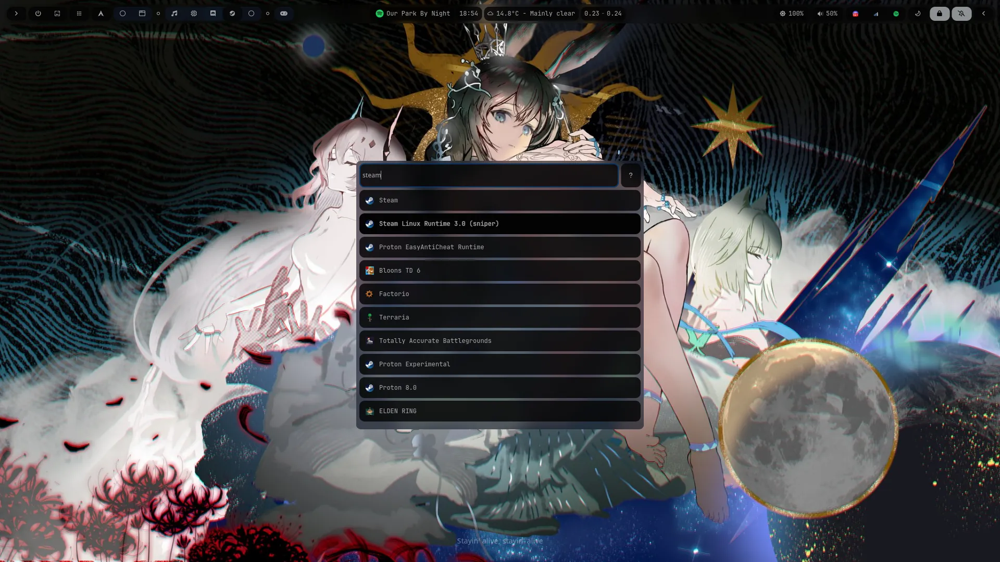 |  | 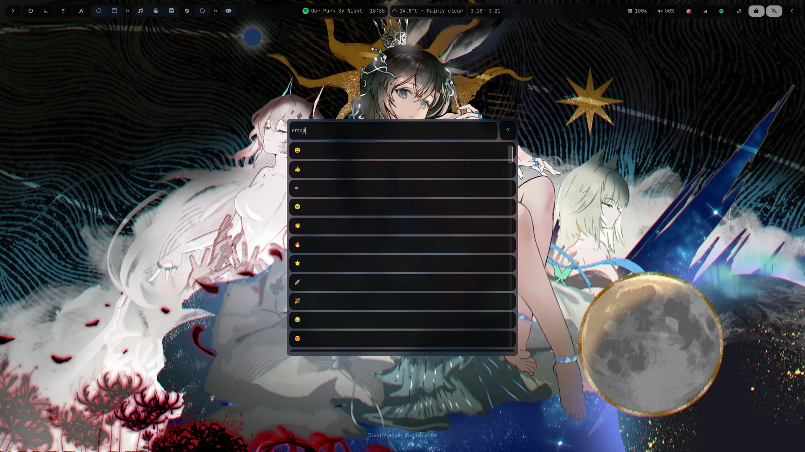 | 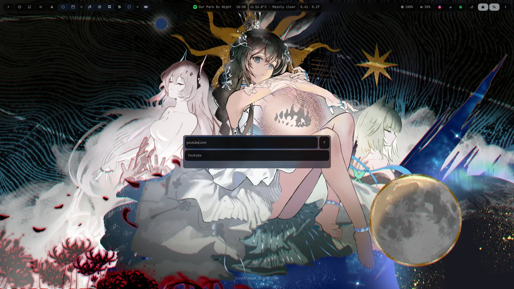 |

## Right Panel

> You can customize the widget layout however you want!

| Example Layout                                    | Example Layout                                    |
| ------------------------------------------------- | ------------------------------------------------- |
| 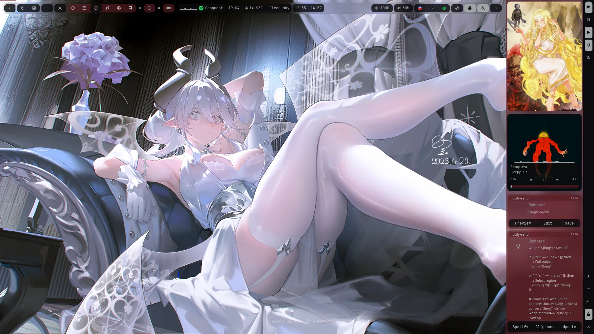 | 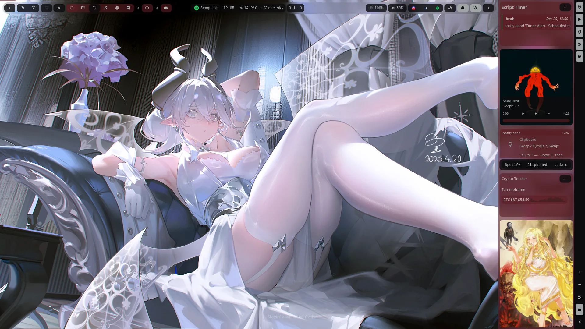 |

## Left Panel

| Chat Bot                                        | Booru Viewer                                                                                    | Hyprland & AGS settings                          |
| ----------------------------------------------- | ----------------------------------------------------------------------------------------------- | ------------------------------------------------ |
| 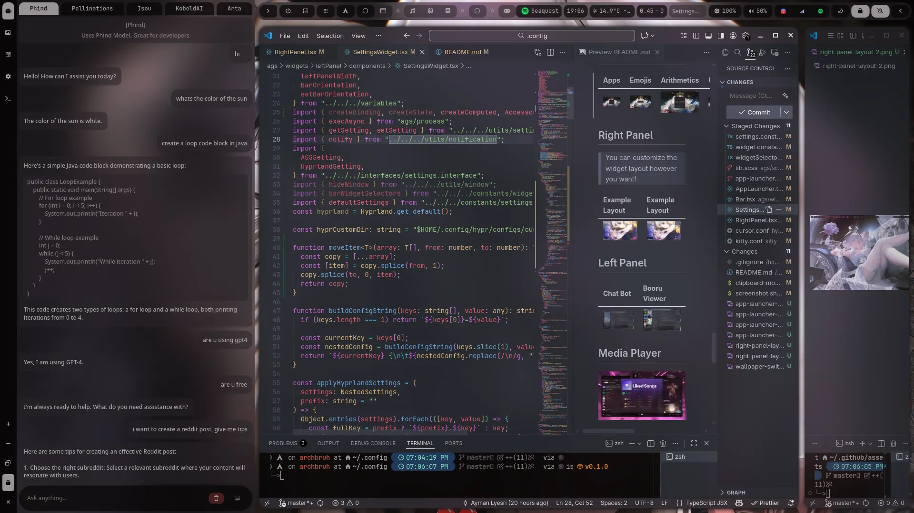 | 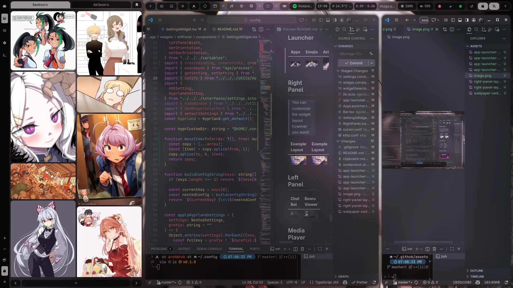 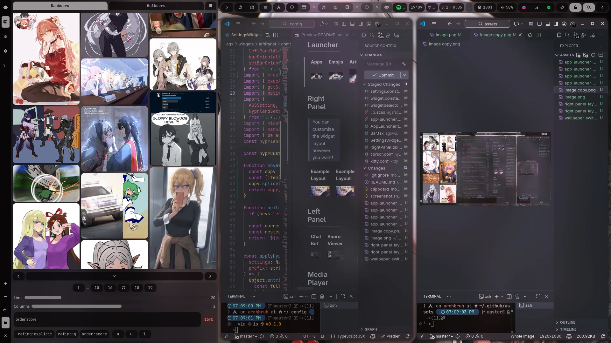 | 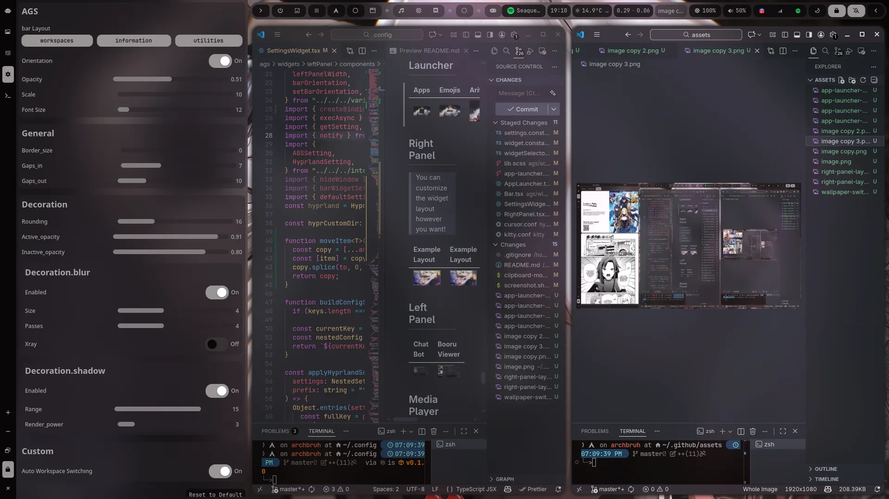 |

## Wallpaper Switcher

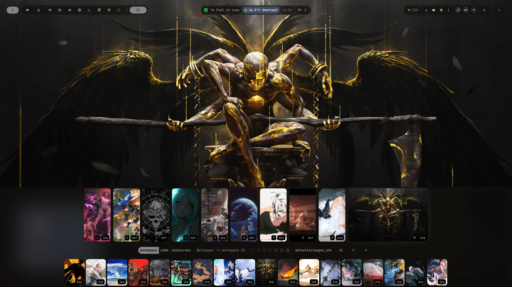

## Theme Switching

| Dark Theme + Custom colors based on wallpaper | Light Theme + Custom colors based on wallpaper |
| --------------------------------------------- | ---------------------------------------------- |
| 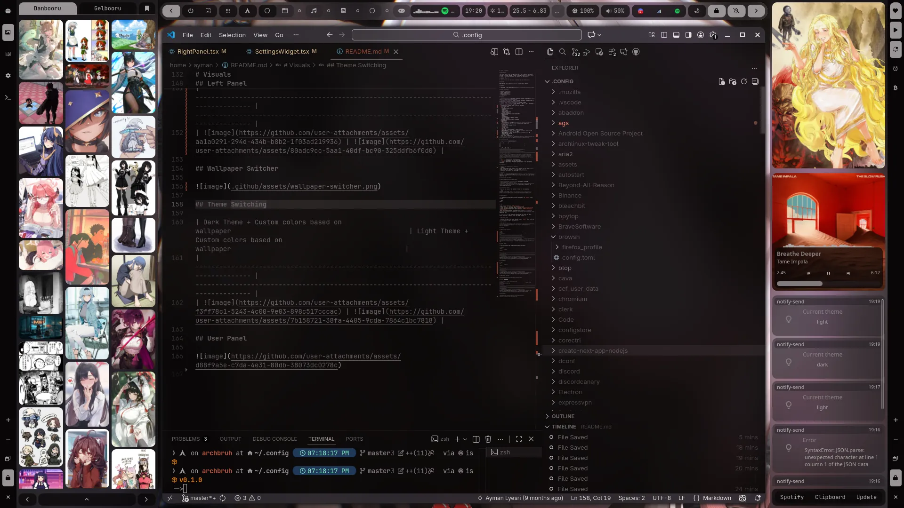       | 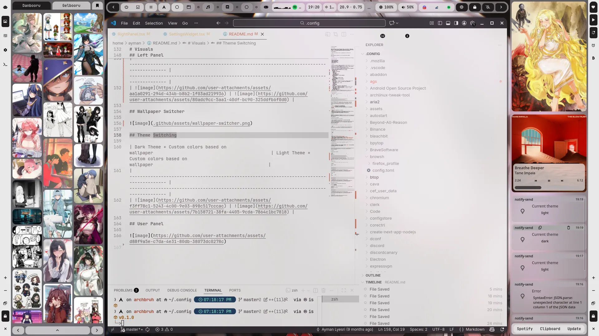       |

## User Panel

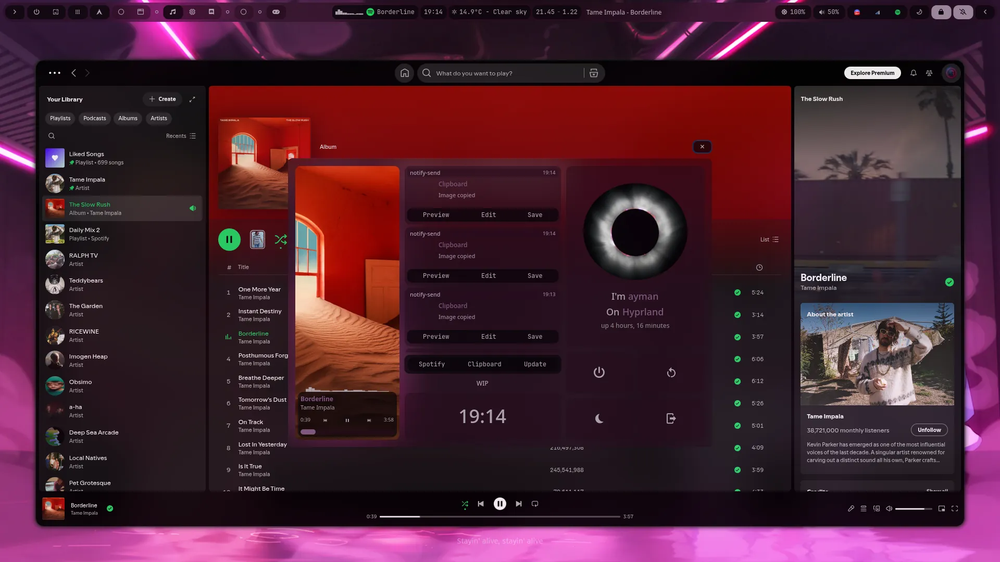
