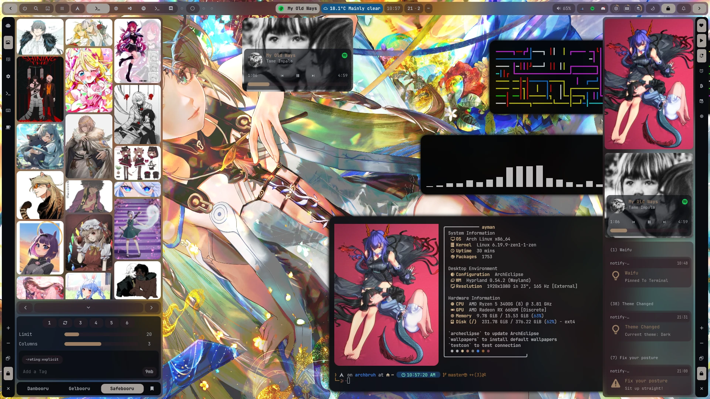
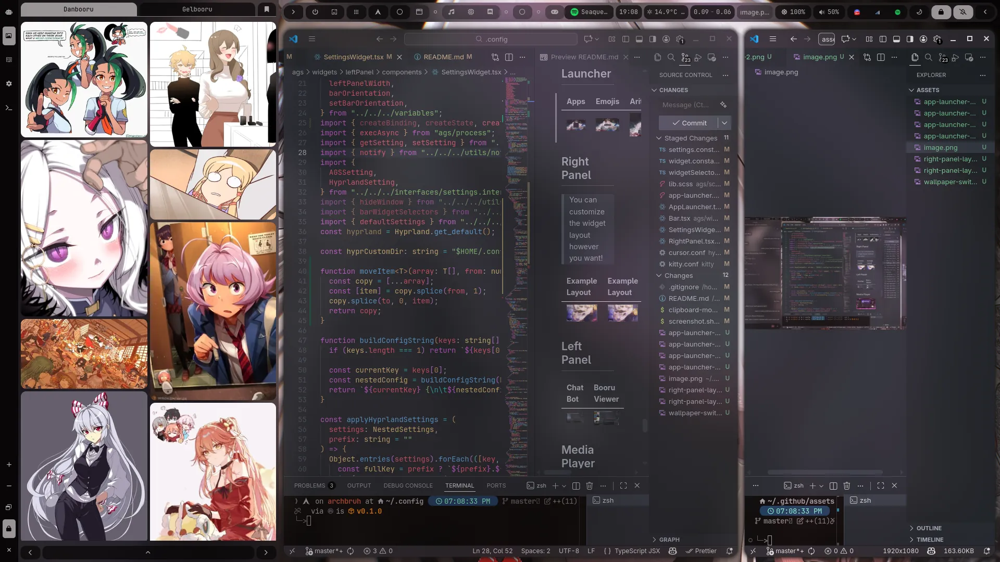
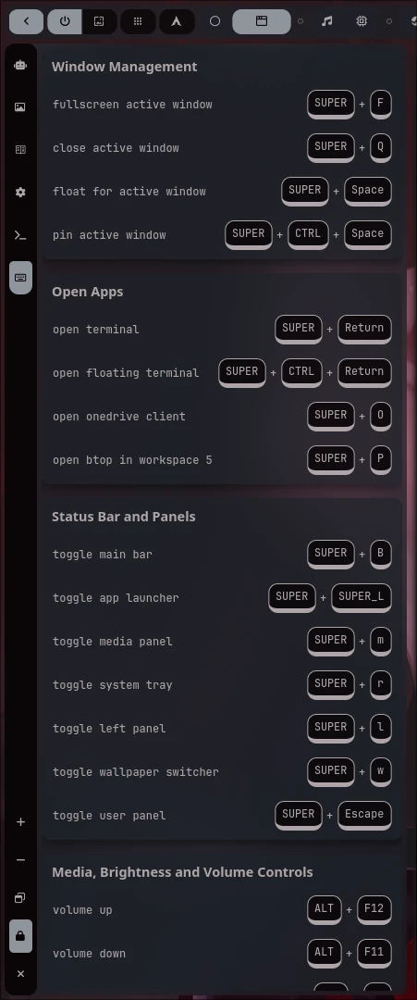
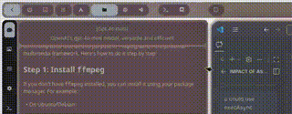
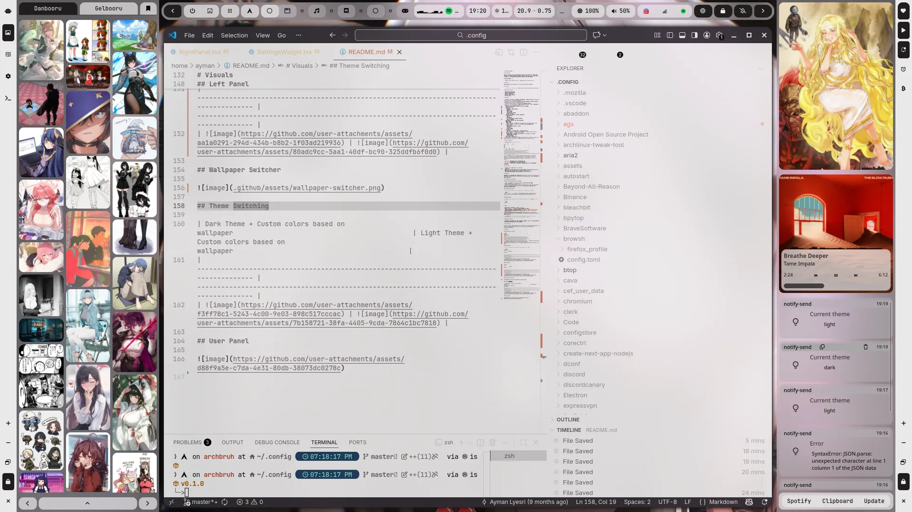

<div align="center">



<br/>

# ArchEclipse

**A production-grade Hyprland desktop environment — built from scratch, engineered for daily use.**

[](https://discord.gg/fMGt4vH6s5)

[](https://archlinux.org/)
[](https://hyprland.org/)
[](https://gtk.org/)
[](https://python.org/)
[](https://github.com/AymanLyesri/ArchEclipse/stargazers)
[](https://github.com/AymanLyesri/ArchEclipse/issues)

</div>

---

## What Is This?

ArchEclipse is my personal, battle-tested desktop configuration for Arch Linux + Hyprland. It's a **fully integrated system** that I use daily for coding, trading, gaming, and general productivity.

Every component was written, tuned, and iterated on over real-world use. The result is a cohesive environment where the UI, system utilities, automation scripts, and visual theming all work as a single product — not a patchwork of borrowed configs.

The project spans multiple languages and layers of the stack:

| Layer                              | Technologies                          |
| ---------------------------------- | ------------------------------------- |
| **UI / Widgets**                   | GTK4, TypeScript, TSX (Ags framework) |
| **Automation & Tooling**           | Python 3, Bash                        |
| **Performance-Critical Utilities** | C                                     |
| **Compositor**                     | Hyprland (Wayland)                    |

---

## Architecture & Technical Highlights

### Dynamic Theming Engine

A custom pipeline generates a full system color scheme from the active wallpaper at runtime using [PyWal](https://github.com/dylanaraps/pywal). Colors propagate automatically to GTK4 widgets, terminal, and all UI components. No manual color editing required — ever.

- Per-workspace wallpaper assignment with both static and animated (video) support
- Global light/dark mode toggle with instant application across the entire environment
- Color changes hot-reload without restarting any component

### GTK4 Widget System (TypeScript/TSX)

All shell UI is built with the **Ags GTK4 v3** framework — replacing prior Eww and Ags GTK3 implementations. Widgets are written in TypeScript with TSX, enabling type-safe, component-based UI development that mirrors modern web frontend workflows.

The bar is fully modular — widgets are swappable at runtime. Current slots include:

- Workspace overview with live thumbnails
- Network bandwidth monitor
- Weather integration
- Media player (MPRIS)
- System tray
- Notification popups
- Live crypto price display

### Application Launcher (Rofi Replacement)

A custom-built launcher written in GTK4/TS replacing Rofi entirely, with built-in support for:

- App launching with fuzzy search
- Clipboard history browser
- Emoji picker
- Inline arithmetic evaluation
- URL forwarding to default browser
- Arbitrary custom command execution

### Panels

**Right Panel** — Configurable layout with swappable widgets: media player, notification history, calendar, script runner, crypto portfolio viewer, and an anime image viewer powered by the [Danbooru](https://danbooru.donmai.us) and [Gelbooru](https://gelbooru.com) APIs.

**Left Panel** — Power-user tools: an integrated chatbot (multi-API), a booru image browser, a manga reader ([MangaDex](https://mangadex.org/) API, WIP), live keybinds reference, and a Hyprland/Ags settings panel.

### Installer & Updater

The entire configuration deploys via a single command using a Python-based installer that handles dependency resolution, git-based dotfile deployment, and package management automatically. Post-install, the environment stays up to date with a single `archeclipse` command.

---

## Workspace Layout

| Workspace      | Assigned Application |
| -------------- | -------------------- |
| W2             | Browser              |
| W4             | Spotify              |
| W5             | Btop                 |
| W6             | Discord              |
| W7             | Steam / Lutris       |
| W10            | Games                |
| W1, W3, W8, W9 | General purpose      |

Applications launch automatically into their designated workspaces at login.

---

## Installation

**Requirements:** Arch Linux (or Arch-based), Hyprland configured and working, Python 3.

> All other dependencies are installed automatically by the installer.

### One-line Install

```bash
python3 <(curl -fsSL https://raw.githubusercontent.com/AymanLyesri/ArchEclipse/refs/heads/master/.config/hypr/maintenance/install.py)
```

### Update

```bash
archeclipse
```

---

## Configuration Tips

- **User avatar:** `$HOME/.face.icon`
- **Wallpaper picker:** `SUPER + W`
- **Custom wallpapers:** `$HOME/.config/wallpapers/custom`
- **Custom Hyprland config:** `$HOME/.config/hypr/configs/custom`
- **Laptop users:** Install `upower` for battery monitoring
- **Full keybinds reference:** [keybinds.conf](https://github.com/AymanLyesri/ArchEclipse/blob/master/.config/hypr/configs/keybinds.conf) or via the Left Panel in-environment

---

## Roadmap

- [ ] Per-component tutorials and documentation _(in progress)_
- [ ] Gaming performance optimization _(in progress)_
- [ ] MangaDex manga reader _(in progress)_
- [ ] Continuous polish and refinement _(ongoing)_

Issues, suggestions, and feature requests are always welcome — [open one here](https://github.com/AymanLyesri/ArchEclipse/issues).

---

## Support

If this project saved you time or you just enjoy it, a coffee helps keep development going.

<div align="center">

# ❤️ Support My Work

<a href="https://ko-fi.com/aymanlyesri">
  
</a>
<a href="https://www.buymeacoffee.com/aymanlyesri">
  
</a>
<a href="https://paypal.me/LyesriAyman">
  
</a>
<br>


<table>
<tr>
<td align="center">

**₿ Bitcoin**

```txt
1JisW9xeatCFadtgsenjbpCcFePZGPyXow
```

</td>
<td align="center">

**Ξ Ethereum / BSC**

```txt
0x52d06d47bb9dc75eaf027f18cb197d5817989a96
```

</td>
</tr>
</table>

---

## Star History

[](https://star-history.com/#aymanlyesri/ArchEclipse&Date)

---

## Visuals

### Application Launcher


### Right Panel — Configurable Layouts

| Layout A                                                  | Layout B                                                  |
| --------------------------------------------------------- | --------------------------------------------------------- |
|  |  |

### Left Panel

| Chatbot                                           | Booru Viewer                                    |
| ------------------------------------------------- | ----------------------------------------------- |
|  |  |

| Settings                                            | Keybinds                                            |
| --------------------------------------------------- | --------------------------------------------------- |
|  |  |

### Wallpaper Switcher


### Workspace Overview



### Theme Switching

| Dark Mode                              | Light Mode                               |
| -------------------------------------- | ---------------------------------------- |
|  |  |

### Keystroke Visualizer _(optional)_


### User Panel


