<div align="center">

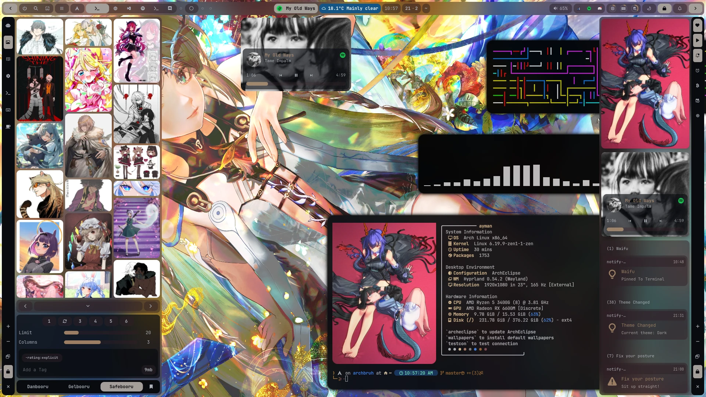

<br/>

# ArchEclipse

**Hyprland desktop that just works — daily-driven, fully themed, one-command install.**

[](https://discord.gg/fMGt4vH6s5)
[](https://archlinux.org/)
[](https://hyprland.org/)
[](https://quickshell.org/)
[](https://doc.qt.io/qt-6/qtquick-index.html)
[](https://python.org/)
[](https://github.com/AymanLyesri/ArchEclipse/stargazers)
[](https://github.com/AymanLyesri/ArchEclipse/issues)

</div>

---

## TL;DR

- **What:** Arch + Hyprland + custom Quickshell UI. Bar, launcher, panels, theming — all integrated.
- **Install:** 1 command (below). Update with `archeclipse`.
- **Try first:** `SUPER + W` = wallpapers. Full keys: [bind.lua](https://github.com/AymanLyesri/ArchEclipse/blob/master/.config/hypr/config/bind.lua).

---

## Install

**Need:** Arch / Arch-based + Hyprland + Python 3. Rest is auto-installed.

```bash
python3 <(curl -fsSL https://raw.githubusercontent.com/AymanLyesri/ArchEclipse/refs/heads/master/.config/hypr/maintenance/install.py)
```

```bash
archeclipse   # update anytime (zsh fn → runs maintenance/update.py)
```

---

## What you get

| Need | How |
| ---- | --- |
| **Bar** | Modular widgets: workspaces, bandwidth, weather, player, tray, crypto |
| **Launcher** | App search + clipboard + emoji + calc + URLs + custom cmds. No Rofi. |
| **Right panel** | Player, notifications, calendar, crypto, anime viewer |
| **Left panel** | Chatbot, booru browser, manga reader (WIP), keybinds, settings |
| **Theming** | Wallpaper → full system colors. Light/dark toggle. Hot-reload. No manual edits. |

**Stack:** QML/QtQuick (Quickshell) · Python 3 + Bash · C (perf utils) · Hyprland/Wayland

| Workspace | Opens |
| --------- | ----- |
| W2 / W4 / W5 / W6 / W7 / W10 | Browser / Spotify / Btop / Discord / Steam / Games |
| W1, W3, W8, W9 | General |

> Apps auto-launch to their workspace at login.

---

## Essentials

- **Avatar:** `$HOME/.face.icon`
- **Wallpapers:** `SUPER + W` → picker. Add yours to `$HOME/.config/wallpapers/custom`
- **Hyprland tweaks:** `$HOME/.config/hypr/config/custom`
- **Laptop:** install `upower` for battery
- **Keys:** [bind.lua](https://github.com/AymanLyesri/ArchEclipse/blob/master/.config/hypr/config/bind.lua) or Left Panel in-app

---

<details>
<summary><b>How it works — architecture, theming, widgets (click to expand)</b></summary>

<br/>

**One idea:** UI + scripts + theming ship as one product. Not random dotfiles.

### Architecture

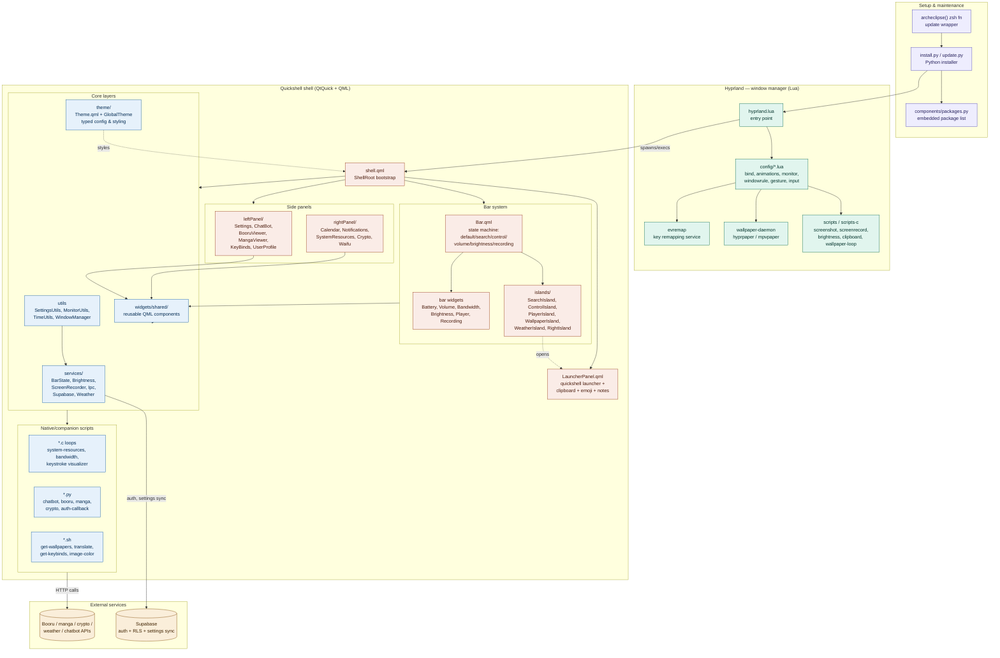
```mermaid
graph TB
    subgraph Install["Setup & maintenance"]
        Installer["install.py / update.py<br/>Python installer"]
        Pacman["components/packages.py<br/>embedded package list"]
        Archeclipse["archeclipse() zsh fn<br/>update wrapper"]
    end

    subgraph Hypr["Hyprland — window manager (Lua)"]
        HyprMain["hyprland.lua<br/>entry point"]
        HyprConfig["config/*.lua<br/>bind, animations, monitor,<br/>windowrule, gesture, input"]
        HyprScripts["scripts / scripts-c<br/>screenshot, screenrecord,<br/>brightness, clipboard, wallpaper-loop"]
        WallpaperDaemon["wallpaper-daemon<br/>hyprpaper / mpvpaper"]
        Evremap["evremap<br/>key remapping service"]
    end

    subgraph QS["Quickshell shell (QtQuick + QML)"]
        Shell["shell.qml<br/>ShellRoot bootstrap"]

        subgraph BarSys["Bar system"]
            Bar["Bar.qml<br/>state machine:<br/>default/search/control/<br/>volume/brightness/recording"]
            BarIslands["islands/<br/>SearchIsland, ControlIsland,<br/>PlayerIsland, WallpaperIsland,<br/>WeatherIsland, RightIsland"]
            BarSub["bar widgets<br/>Battery, Volume, Bandwidth,<br/>Brightness, Player, Recording"]
        end

        AppLauncher["LauncherPanel.qml<br/>quickshell launcher +<br/>clipboard + emoji + notes"]

        subgraph Panels["Side panels"]
            LeftPanel["leftPanel/<br/>Settings, ChatBot,<br/>BooruViewer, MangaViewer,<br/>KeyBinds, UserProfile"]
            RightPanel["rightPanel/<br/>Calendar, Notifications,<br/>SystemResources, Crypto, Waifu"]
        end

        subgraph Core["Core layers"]
            Widgets["widgets/shared/<br/>reusable QML components"]
            Services["services/<br/>BarState, Brightness,<br/>ScreenRecorder, Ipc,<br/>Supabase, Weather"]
            Utils["utils<br/>SettingsUtils, MonitorUtils,<br/>TimeUtils, WindowManager"]
            Theme["theme/<br/>Theme.qml + GlobalTheme<br/>typed config & styling"]
        end

        subgraph NativeScripts["Native/companion scripts"]
            CLoops["*.c loops<br/>system-resources, bandwidth,<br/>keystroke visualizer"]
            PyScripts["*.py<br/>chatbot, booru, manga,<br/>crypto, auth-callback"]
            ShScripts["*.sh<br/>get-wallpapers, translate,<br/>get-keybinds, image-color"]
        end
    end

    subgraph Backend["External services"]
        Supabase[("Supabase<br/>auth + RLS + settings sync")]
        APIs[("Booru / manga / crypto /<br/>weather / chatbot APIs")]
    end

    Installer --> Pacman
    Installer --> HyprMain
    Archeclipse --> Installer

    HyprMain --> HyprConfig
    HyprConfig --> HyprScripts
    HyprConfig --> WallpaperDaemon
    HyprConfig --> Evremap
    HyprMain -- "spawns/execs" --> Shell

    Shell --> BarSys
    Shell --> AppLauncher
    Shell --> Panels
    Shell --> Core

    Bar --> BarIslands
    Bar --> BarSub
    BarIslands -.->|opens| AppLauncher

    Widgets --> Core
    LeftPanel --> Widgets
    RightPanel --> Widgets
    BarSys --> Widgets

    Core --> NativeScripts
    Utils --> Services
    Services -->|"auth, settings sync"| Supabase
    NativeScripts -->|"HTTP calls"| APIs

    Theme -.->|styles| Shell

    classDef install fill:#EEEDFE,stroke:#534AB7,color:#26215C
    classDef hypr fill:#E1F5EE,stroke:#0F6E56,color:#04342C
    classDef qs fill:#FAECE7,stroke:#993C1D,color:#4A1B0C
    classDef core fill:#E6F1FB,stroke:#185FA5,color:#042C53
    classDef ext fill:#FAEEDA,stroke:#854F0B,color:#412402

    class Installer,Pacman,Archeclipse install
    class HyprMain,HyprConfig,HyprScripts,WallpaperDaemon,Evremap hypr
    class Shell,Bar,BarIslands,BarSub,AppLauncher,LeftPanel,RightPanel qs
    class Widgets,Services,Utils,Theme,CLoops,PyScripts,ShScripts core
    class Supabase,APIs ext
```

### Theming

- Wallpaper → colors via [Cwal](https://github.com/nitinbhat972/cwal) (C PyWal, 10-50x faster).
- Auto-applies to Quickshell, terminal, UI. Zero manual edits.
- Per-workspace static / video wallpapers. Light/dark toggle. Hot-reload.

### Widgets (Quickshell / QML)

- Reactive QML via `shell.qml` + singletons (`BarState`, `GlobalTheme`, `Supabase`, `Weather`).
- Bar slots swappable at runtime.
- Note: migrated from Eww/AGS on 2026-09-12. Old `~/ArchEclipse-AGS` / `~/agsv1` folders are safe to delete.

### Launcher details

Fuzzy search · clipboard history · emoji · calc · URL forward · custom cmds.

### Panels detail

- **Right:** media, notifications, calendar, script runner, crypto, Danbooru/Gelbooru viewer.
- **Left:** chatbot (multi-API), booru browser, MangaDex reader (WIP), live keybinds, Hyprland/Quickshell settings.

### Deployer

Python installer = deps + dotfiles + packages. One command in, `archeclipse` keeps you updated.

</details>

---

## Roadmap

- [ ] Per-component docs _(in progress)_
- [ ] Gaming perf tuning _(in progress)_
- [ ] Ongoing polish

Bugs / ideas → [open an issue](https://github.com/AymanLyesri/ArchEclipse/issues).

---

## Visuals

### Launcher

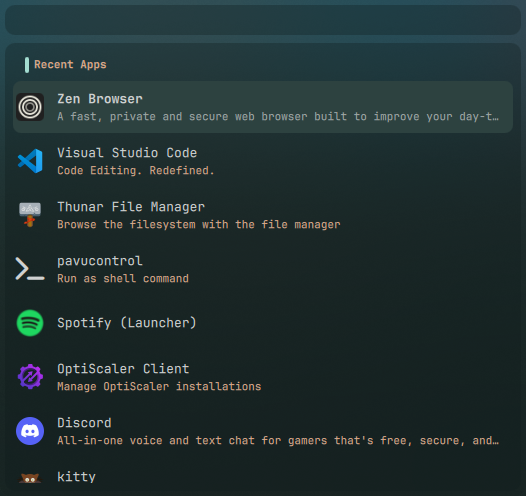

### Right Panel

| Waifu · Player · Calendar · Notifications | Calendar · Player · Waifu · Resources |
| --- | --- |
| 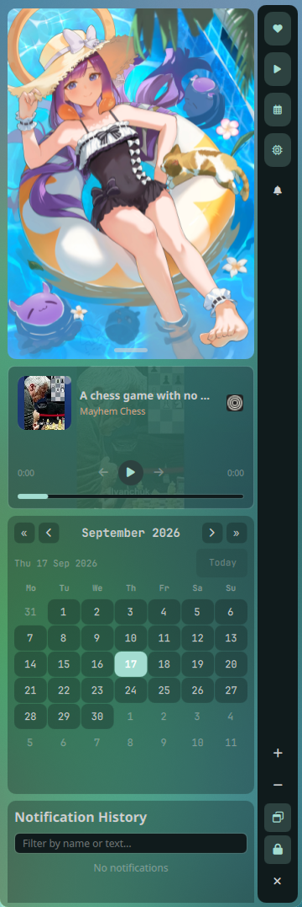 | 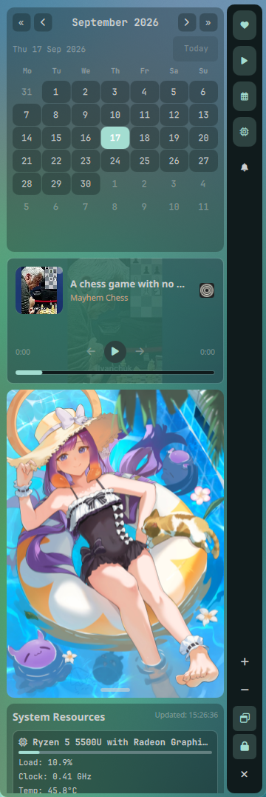 |

### Left Panel

| Chatbot | Booru |
| ------- | ----- |
| 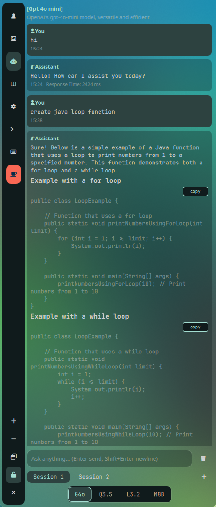 | 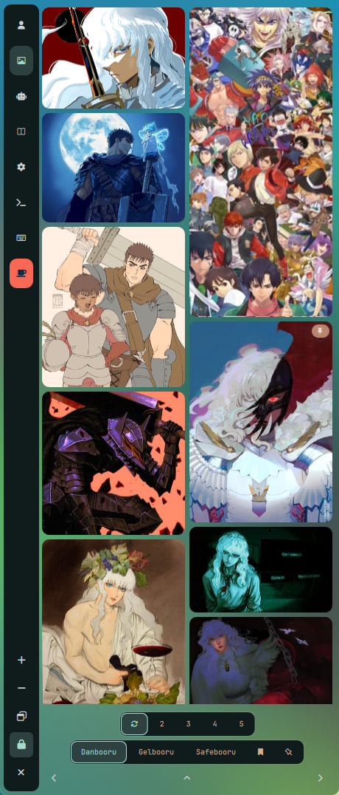 |

| Settings | Keybinds |
| -------- | -------- |
| 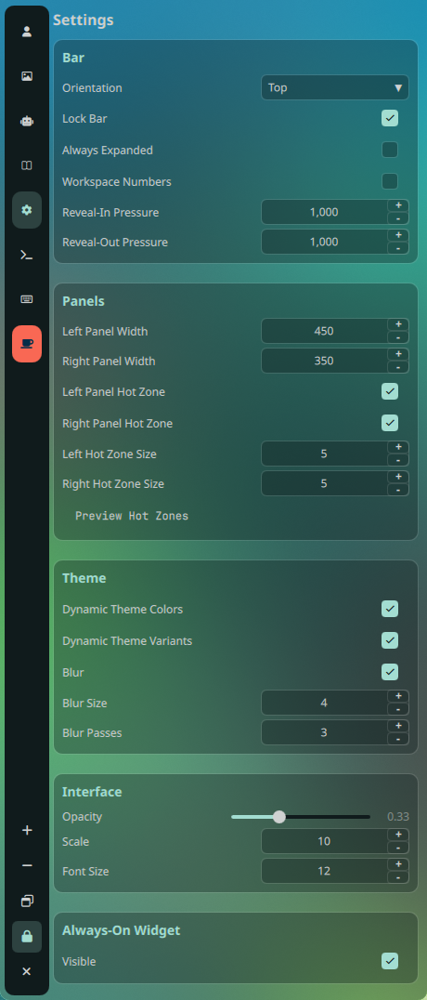 | 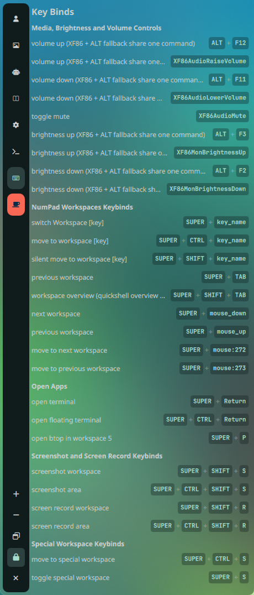 |

### Wallpaper · Workspaces · Lock

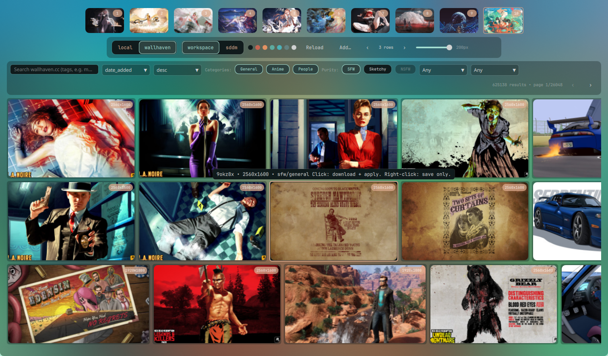
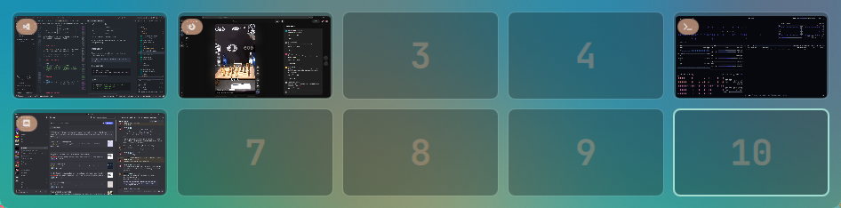
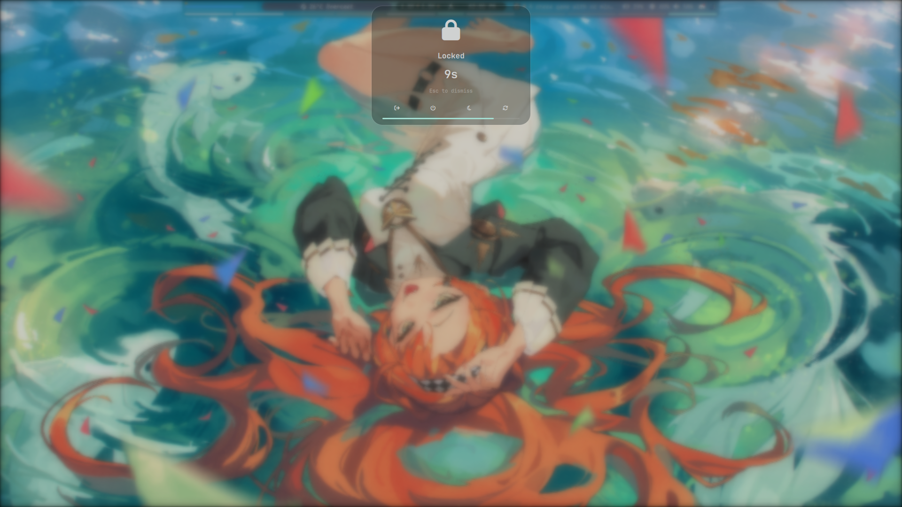

---

## ❤️ Support

Coffee = more dev. Thanks.

<div align="center">

<a href="https://ko-fi.com/aymanlyesri">
  
</a>
<a href="https://www.buymeacoffee.com/aymanlyesri">
  
</a>
<a href="https://paypal.me/LyesriAyman">
  
</a>

<details>
<summary>Crypto addresses</summary>

**₿ Bitcoin**
```txt
1JisW9xeatCFadtgsenjbpCcFePZGPyXow
```

**Ξ Ethereum / BSC**
```txt
0x52d06d47bb9dc75eaf027f18cb197d5817989a96
```

</details>

[](https://star-history.dera.page/#aymanlyesri/ArchEclipse&Date)

</div>
